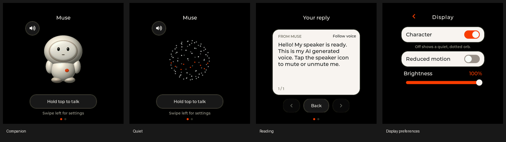

# Refined Muse UI

Implemented and installed on the connected Waveshare ESP32-S3-Touch-AMOLED-1.75C on October 8, 2026. This implements the Grep-inspired direction in [the design proposal](../MUSE_UI_POLISH_PLAN.md).



## Using it

- **Companion:** a shaded cream character on black, with orange activity cues. Hold the top button to talk and release to send. Touch the character for a reaction. Tap the speaker button to mute or unmute; a held tap toggles only once, and dragging away cancels it.
- **Replies:** a cream card appears as the character makes room. The latest reply remains available after speech ends. Tap the card to open Reading; Done dismisses it. A new voice turn clears the previous answer.
- **Reading:** previous/next buttons browse text at your own pace. Opening Reading pauses automatic page following. Follow voice resumes it. Back returns to the small character and reply card. Horizontal swiping still opens Settings.
- **Quiet:** swipe left, open Daily → Display, and turn Character off. This replaces the character with a dotted sphere. It does not mute audio. The preference survives a restart.
- **Motion and brightness:** Display also contains Animations and Brightness. Turning Animations off removes the character movement, animated expressions, orb rotation, waveform motion and answer transition; state labels still explain activity.
- **Sleep:** the bottom button retains its sleep/wake behavior. Decorative work stops while asleep or while Settings is visible.

Settings, pairing and reply surfaces use Grep cream `#FAF6F1`, orange `#FF3C00`, charcoal `#181818`, layered edges and rounded corners. Full settings rows are touch targets. The interface uses antialiased Montserrat and the existing CJK fallback font.

## Implementation

`muse_refined_ui.c` owns the full-size view; `muse_theme.c` supplies materials and typography. The original pixel renderer remains the fallback on compact displays and when the richer view cannot allocate its buffers. `CONFIG_MUSE_REFINED_UI` defaults on for the two 1.75-inch Waveshare profiles and Watcher, and can be disabled. CJK defaults on with the refined UI; an existing generated sdkconfig can still explicitly override it.

The character is an original offline 3D ellipsoid model, rendered orthographically with diffuse and specular lighting. Seven poses are stored at 224 and 96 pixels, using a shared RGB565 palette and run-length compression. The asset pack occupies **264,366 bytes**. The runtime renderer uses a bounded 150,528-byte index/pixel workspace in PSRAM. It changes poses, gently moves the character, and animates the dotted presence without a runtime mesh engine or full-screen video.

Regenerate the checked-in asset source with Python, NumPy and Pillow:

```sh
python tools/muse/render_character.py
```

`muse_reply.c` transfers normalized reply text and its speech byte offset from the chat producer through a mutex into the UI. The UI has a separate copy and never calls LVGL from a voice/network task. The 16 KiB text bound matches the current chat backend. The retained text is the current assistant message, not a conversation archive, and is cleared on a new turn or restart.

`muse_markdown.c` parses replies with vendored MD4C 0.5.2, retaining style flags and original byte positions in a bounded PSRAM document. Its paginator measures each styled font and preserves UTF-8 and CJK closing punctuation. The original plain-text paginator remains available for the legacy UI/tests. Changing view follows the same byte position. Explicit page navigation holds the chosen position until Follow voice or a new turn. `muse_presentation.c` prevents replaying the answer entrance after dismissal or idle/reconnect events.

Both Character and Reduced motion are stored in the existing NVS namespace. No credentials, partition layout, signing policy or physical button mapping were changed for this UI. Existing speech and optional Pocket work in the working tree was preserved; Pocket caption events also feed the new reply view.

## Phone pairing follow-up (October 8)

The latest application pauses the Pocket WebSocket task while a phone is
connected over BLE, and starts it again after phone setup ends and Wi-Fi is
available. This releases its 8 KiB internal stack for the account-provisioning
worker. The storage worker stays active; pending recordings are retained.
The Bluetooth page now describes setup in the Muse phone app.

This update was built with ESP-IDF 6.0.1 and flashed only at 0x20000, with hash
verification. Application SHA-256:
fd9b613b06fc234ddb34bdb754ddeada3ef6c10e27156fd5942da3e9b2d8642f.
The size remains 3,543,040 bytes. The 228-test host suite passed, followed by
five new connection-supervisor tests covering pause/resume, Wi-Fi loss,
graceful close and failed task allocation.

After reboot, LucaGPT reconnects at 172.20.10.2, Companion mode and animations
remain enabled, and all three pending captures remain in storage (183,481
bytes used). Phone account pairing is currently incomplete. Before this fix,
logs showed successful encrypted Bluetooth confirmation and Wi-Fi scanning,
but no final provision_v2 command before the pairing session expired.
A fresh phone pairing attempt is required to establish whether the spinner
is resolved. During monitoring, LucaGPT later disappeared from scans after
a Wi-Fi disconnect (reason 200); automatic retries remain active. The Mac
companion is separately unreachable while the Mac is on office Wi-Fi and
Muse is on LucaGPT.

## Markdown, motion and complete settings update

The current combined Pocket/refined build uses MD4C 0.5.2 to render headings,
real bold/italic/bold-italic type, ordered and nested lists, task lists, quotes,
monospaced code, links and strikethrough. Tables reflow into labelled cells
that fit the round display. Link text is underlined; it does not open a browser.
Image alternatives remain readable and raw HTML is literal. Named/numeric
entities decode before rendering. Source offsets still follow the voice;
manual pages stay selected even when generated table labels share an offset.
The document is capped at 32 KiB of visible UTF-8 plus styles/source mappings
(128 KiB total in PSRAM). If expansion or nesting exceeds that budget, the
original bounded reply remains readable as plain text.

Settings has three visible groups, with every top-level destination available
without vertical scrolling: Daily (Sound, Display, Sleep), Connect (Wi-Fi,
Bluetooth, Muse), and Device (Battery, About, Power off). Subpages retain the
existing controls and now show a scroll indicator when needed. About shows
board, firmware, display size, network and physical-button help. Muse reports
the actual Pocket Companion connection above the existing pairing controls.

The previous motion issue was a saved Reduced motion preference. The control
is now positively labelled **Animations**, while retaining the existing NVS
key and its accessibility behavior. Character idle movement is visible even
with an offline notice. The Quiet orb updates at 12 fps idle / 20 fps active,
with time-based rotation. Sleep and hidden settings still pause decorative
work. USB setup accepts character=0|1 and reduced_motion=0|1; status includes
the display preferences. Bench preview ui=markdown supplies a deterministic
formatted reply, while settings-connect/settings-device/about open new views.

Validation: 228 firmware host tests pass without skips, including Markdown
syntax, styles, source offsets, UTF-8, long replies and bounded fallback.
The normal and ASan/UBSan simulators pass at 412 and 466 pixels, including
real touch navigation, reading, settings persistence semantics, both animated
modes, static reduced-motion frames and circular safe-area checks.

The Markdown application was installed from the repository-root build-muse-pocket
build (ESP-IDF 6.0.1, Waveshare 1.75C, Pocket and refined UI both enabled).
It occupies 3,543,040 bytes of the 4,194,304-byte app slot. SHA-256:
75e2643f3a539ad1a0d0f70e91632eb03ee847e43b9d11de4e4f71d0d06c2574.
Only the application at 0x20000 was flashed, after backing up the old app slot.
Flash hash verification, a healthy reboot, retained pairing/settings, and the
Pocket storage diagnostic passed. Animations remains enabled after restart;
the existing Quiet and speaker-mute preferences were preserved.

Actual-device Markdown and all three Settings groups are captured in
simulator/screenshots/refined/device/ui-upgrade. Local test replies exercised
parsing/rendering on the installed firmware; an online turn could not be tested
because the saved LucaGPT hotspot was not visible at this check. The test reply
was cleared before handoff. Stored companion configuration, recording format 2
and zero queued captures remain intact.

In four-second hardware samples, Companion averaged 5.345 ms per refresh with
9.588 ms maximum; Quiet averaged 6.938 ms with 10.031 ms maximum. Each sample
had 108 refreshes and none exceeded the 40 ms frame budget. Independent screen
captures changed more than 10,000 character pixels and 2,000 orb pixels,
confirming both modes animate on the actual board. Full measurements and
post-reboot state are in ui-upgrade/animation-metrics.json and verification.json.

## Initial installation and checks

The installed build is `build-muse-waveshare-s3-175c-bench`, built with ESP-IDF **v6.0.1**. The board identified itself in its boot log before flashing. The flashed application is **3,280,896 bytes** in the existing **4,194,304-byte** OTA slot, leaving **913,408 bytes (21.8%)**. Flash verification succeeded. NVS was preserved, and the device reconnected to its existing Muse session after reboot.

Validation completed:

- All **216 host tests** passed; the chat tests also passed after adding turn-boundary integration.
- Production UI simulator scenarios cover both **466 × 466** and **412 × 412** displays, including reply retention, Reading, Quiet, mixed CJK/Latin text, settings, setup, pairing, offline/error and voice states.
- Deterministic screenshots and a circular safe-area check pass. Pointer tests cover tap/hold/drag mute behavior, page navigation, follow/resume, interruption, and independent Character/Motion preferences.
- AddressSanitizer and UndefinedBehaviorSanitizer simulator runs pass. Leak detection is disabled because the macOS ASan runtime does not support it.
- Compact/fallback branches of UI, Settings and state code compile with warnings treated as errors.
- Actual device captures verify Companion, Quiet, Display, a retained reply and Reading. Quiet mode was set, the board rebooted, and the saved preference was verified before restoring Companion.
- Two real OpenAI speech tests completed: **8.05 seconds** in the first run and **9.05 seconds** after the final motion adjustment, with retained text and a working Reading view. No panic, reboot loop or audio-backlog/underrun warning appeared in the captured test logs.

Short USB-powered samples on the board, against the existing 40 ms frame schedule:

| View | Average UI update | Average LVGL refresh | Maximum refresh | Refreshes over 40 ms |
| --- | ---: | ---: | ---: | ---: |
| Companion idle | 0.736 ms | 2.294 ms | 10.046 ms | 0 / 111 |
| Thinking | 0.913 ms | 2.890 ms | 5.460 ms | 0 / 155 |
| Quiet thinking | 2.518 ms | 8.453 ms | 19.525 ms | 0 / 148 |
| Initial speech test | 0.964 ms | 2.783 ms | 41.277 ms | 1 / 309 |
| Final speech test | 0.910 ms | 2.613 ms | 27.199 ms | 0 / 333 |

Settings and sleep samples recorded zero decorative updates. The final post-speech sample had 31,191 bytes of free internal memory and 2,498,204 bytes of free PSRAM. These are sampled values, not allocation high-water measurements. LVGL timings measure refresh work, not an external measurement of panel scanout. The initial isolated 41.277 ms refresh slightly exceeded the frame budget; the final speech sample stayed within it.

Installed app SHA-256: `aa7ed7538623f1017ef8bf7cac03c95d57a83fdc0fdd2b23cec479a9cde7af7d`.

USB became available again for the final handoff check on October 8. The board identified itself as the same Waveshare model; the test reply was cleared and the view returned to Companion. The fresh capture is `simulator/screenshots/refined/device/handoff.png`, with measurements in `handoff-metrics.json`: all 85 sampled refreshes stayed below 40 ms (4.795 ms average, 4.973 ms maximum).

At this handoff, the device reported its saved Wi-Fi network as `not_nearby`, so the UI correctly displayed its offline notice. Pairing remained intact. The successful connected speech tests above were completed earlier. The existing speaker mute preference was preserved.

Following the user's Wi-Fi configuration request, both Replit and MissionHub were provisioned from the local `.env` through the existing USB setup commands, with Replit saved first in the network list. A restart and actual Settings capture confirmed that both networks persisted (`simulator/screenshots/refined/device/saved-wifi.png`). Boot and subsequent automatic scans ran, including a named probe for Replit, but the board still reported `not_nearby`. Saved settings and automatic retry behavior are verified; a successful Replit connection is not yet verified. No Wi-Fi passwords were added to source, documentation or screenshots.

Replit Guest was subsequently added from `WORK_2_SSID` and the user's `WORK_2_PASSWOR` key in `.env`, preserving the existing networks. Setup was acknowledged without a reported save error. After another restart, status identified Replit Guest as the first saved network and confirmed pairing remained intact. The boot scan found eight access points representing three distinct SSIDs, but automatic connection attempts still ended in `not_nearby`. USB then disconnected during monitoring; a successful Replit Guest connection remains unverified.

With USB restored, a direct Replit Guest join produced four driver disconnects with reason `201` (`WIFI_REASON_NO_AP_FOUND`) and RSSI `-128`; a subsequent general scan saw nine access points across three SSIDs, while the directed saved-network scans found none. The supplied guest credentials exactly matched the values sent from `.env`. The Mac's current connection was on channel 128 at 5 GHz; the ESP32-S3 radio supports 2.4 GHz. These observations suggest checking whether the requested networks broadcast on 2.4 GHz, but do not establish that those SSIDs are exclusively 5 GHz. Muse's Wi-Fi page was opened for a user-triggered scan to inspect the visible network names.

The requested iPhone hotspot, LucaGPT, subsequently connected successfully. Its `.env` password assignment used a colon; that assignment was corrected to `=` before provisioning. Muse received `172.20.10.2`, then automatically rejoined LucaGPT after a restart, with pairing intact and no panic observed. The post-restart signal sample was -49 dBm; details are in `simulator/screenshots/refined/device/hotspot-connection.json`. Existing saved networks were retained. The local companion service was initially disconnected while the Mac remained on office Wi-Fi. After the Mac joined LucaGPT at `172.20.10.3`, Muse reported its companion connection active, no pending items and no operation in progress. Both Wi-Fi and the local application connection are now verified; the device remains at `172.20.10.2`.

Device images and raw measurement fields are in `simulator/screenshots/refined/device/`. The broader visual baselines are in `simulator/screenshots/refined/`. These bench checks do not establish battery endurance, long-run thermal/power behavior, finger accuracy, acoustic quality or a human-spoken dictation turn; those still require hands-on use.

## Reproduce checks

```sh
# From esp32/, with ESP-IDF v6.0.1 activated:
idf.py -B build-muse-waveshare-s3-175c-bench build
python -m unittest discover -s tests -p 'test_*.py'

# From the repository root:
cmake --build esp32/simulator/build
python esp32/simulator/tests/test_simulator.py --binary esp32/simulator/build/muse_simulator
```

The simulator compiles the real Settings UI; services underneath it are faked. Scenario keys include `reply`, `view`, `character`, `reduced_motion`, and semantic `expect_ui_*` assertions. In a screenshot-enabled firmware build, `>ui=face`, `>ui=companion`, `>ui=quiet`, `>ui=reading`, `>ui=settings` and `>ui=display` select views. Quiet/Companion previews save the corresponding display preference. `>ui.metrics` reports and resets the measurement window; serial `p` captures the screen.
